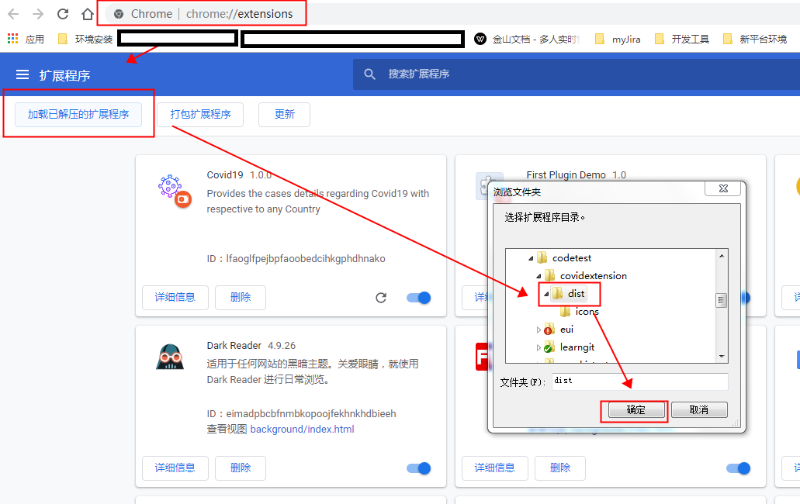

# covid19extension
一个可获取不同国家新型冠状病毒肺炎-covid19案例的信息的chrome插件

## 使用

git clone git@github.com:wavedanger/covid19extension.git

打开chrome浏览器的扩展程序界面，选择已解压的扩展程序，选择dist文件夹即可

## 参考链接

[怎样创建一个谷歌扩展程序](https://mp.weixin.qq.com/s/WzfVfGJgNAXyLlGaYybQzA)